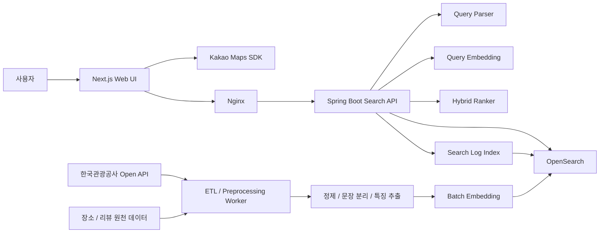
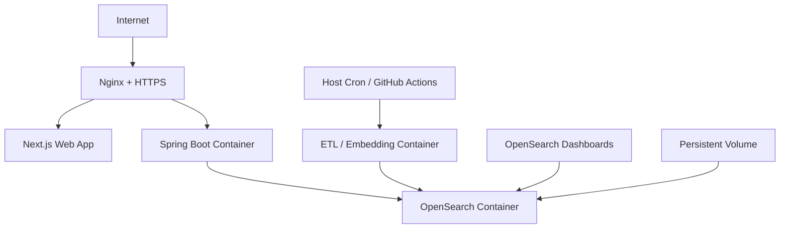

# 제안보고서 기반 기술 스택 및 인프라 아키텍처 설계

> 참고: 이 문서는 초기 리뷰 기반 설계 초안임. 현재 프로젝트 주제는 장소 메타데이터 + 위치 기반 자연어 검색으로 조정했고, 최신 기준은 `docs/development.md`를 따름.

## 1. 설계 전제

본 설계는 제안보고서의 핵심 목표인 `리뷰 의미 분석 + 위치 기반 검색 + Hybrid Retrieval`을 실제 구현 가능한 수준으로 구체화한 아키텍처다.

- 서비스 유형: 자연어 질의 기반 장소 검색 웹 서비스
- 핵심 기능: BM25 검색, 벡터 검색, RRF 기반 하이브리드 랭킹, 거리 기반 재정렬, 리뷰 근거 문장 제공
- 운영 방향: 생성형 LLM은 사용하지 않고, 경량형 의미 검색 구조로 구현
- 데이터 특성: 장소 메타데이터 + 리뷰 문장 + 위치 좌표
- 프로젝트 성격: 졸업작품/MVP 중심, 빠른 구현과 시연 가능성이 중요

이 전제를 기준으로, 과도한 마이크로서비스보다 `단순하지만 확장 가능한 3계층 구조`를 채택한다.

## 2. 권장 기술 스택

| 영역 | 확정 스택 | 선택 이유 |
| --- | --- | --- |
| 프론트엔드 | Next.js + TypeScript | 검색 UI 구성, 페이지 구조화, 향후 SSR/배포 확장에 유리함 |
| UI | Tailwind CSS + shadcn/ui 또는 최소 커스텀 컴포넌트 | 빠른 화면 구현과 유지보수 용이 |
| 지도 | Kakao Maps JavaScript SDK | 제안서와 일치, 국내 장소 검색 시연에 적합 |
| 백엔드 API | Spring Boot | REST API 구성, 타입 안정성, 배포 편의성이 좋아 백엔드 주력 스택으로 적합 |
| 검색 엔진 | OpenSearch | BM25 + k-NN 벡터 검색 + geo query를 한 엔진에서 처리 가능 |
| 임베딩 | Sentence Transformers 계열 한국어 지원 모델 | LLM 없이도 의미 검색 가능, 운영비 낮음 |
| 벡터 인덱스 | OpenSearch k-NN(HNSW) | 제안서의 ANN/HNSW 요구와 일치 |
| 데이터 수집/전처리 | Python + pandas + requests/httpx | 공공 API 수집과 정제 작업에 적합 |
| 배치 작업 | Python ETL 컨테이너 + cron 또는 GitHub Actions | 큐 시스템 없이도 충분한 경량 운영 가능 |
| 웹 서버/리버스 프록시 | Nginx | 정적 파일 서빙, HTTPS 종료, API 프록시 처리 |
| 컨테이너 | Docker + Docker Compose | 개발/시연/배포 환경을 동일하게 맞추기 쉬움 |
| 형상관리/CI | GitHub + GitHub Actions | 제안서와 일치, 자동 배포/테스트 연계 용이 |
| 로그/운영 확인 | OpenSearch Dashboards + 애플리케이션 구조화 로그 | MVP 수준에서 충분한 가시성 확보 |

## 3. 아키텍처 결정

### 3.1 프론트엔드는 Next.js로 확정

제안서에는 `React 또는 Next.js`로 되어 있지만, 실제 구현 단계에서는 `Next.js`를 사용하여 프론트엔드 구조를 정리한다. 현재는 검색 실험 UI가 중심이지만, 추후 SSR, 라우팅, 배포 확장성을 고려하면 `Next.js + TypeScript`가 더 유리하다.

### 3.2 검색 저장소는 OpenSearch 단일 축으로 설계

제안서에 `데이터베이스: OpenSearch Index`가 명시되어 있으므로, MVP 단계에서는 별도 RDBMS 없이 OpenSearch를 중심 저장소로 사용한다.

- 장소 문서 저장
- 리뷰 문장 저장
- 벡터 임베딩 저장
- 위치 좌표 저장
- 검색 로그 저장

즉, `검색 엔진 + 검색용 저장소`를 통합한 구조로 간다.

### 3.3 임베딩 생성은 온라인/배치 혼합

- 배치 시: 리뷰 문장 임베딩을 미리 생성하여 OpenSearch에 색인
- 검색 시: 사용자 질의만 실시간 임베딩

이 방식이면 LLM 서버 없이도 의미 검색이 가능하고, 응답 속도와 비용을 모두 통제할 수 있다.

## 4. 논리 아키텍처



## 5. 구성 요소별 역할

### 5.1 프론트엔드

- 자연어 질의 입력
- 현재 위치 또는 선택 위치 전달
- 검색 결과 리스트 표시
- Kakao Map 기반 마커 표시
- 리뷰 근거 문장(Evidence) 노출
- 거리/카테고리 필터 UI 제공

### 5.2 Spring Boot 검색 API

- 질의 정규화
- 사용자 위치 파라미터 검증
- BM25 검색 요청
- 질의 임베딩 생성
- 벡터 검색 요청
- RRF 기반 결과 통합
- Geo-aware 점수 보정
- 근거 문장 선별 후 응답 반환

### 5.3 ETL / 전처리 워커

- 외부 API/수집 데이터 로드
- 장소 중복 제거
- 리뷰 정제
- 문장 분리
- 장소별 특징 점수 계산
- 임베딩 생성
- OpenSearch bulk indexing

### 5.4 OpenSearch

- 텍스트 검색(BM25)
- 벡터 검색(k-NN / HNSW)
- 지리 검색(geo_distance, geo_point)
- 검색 로그 저장
- 대시보드 기반 간단 운영 확인

## 6. 검색 흐름 설계

1. 사용자가 `"조용하게 공부하기 좋은 카페"`와 현재 위치를 입력한다.
2. 프론트엔드는 질의와 좌표를 Spring Boot API로 전송한다.
3. API는 질의를 정제한 뒤 `places` 인덱스에 BM25 검색을 수행한다.
4. 동시에 질의를 Sentence Transformer로 임베딩하여 `review_sentences` 인덱스에 벡터 검색을 수행한다.
5. 두 검색 결과를 RRF로 통합한다.
6. 통합 결과에 거리 가중치와 반경 필터를 적용한다.
7. 각 장소별로 대표 리뷰 근거 문장을 추출한다.
8. 최종 결과를 리스트 + 지도 마커 정보 형태로 반환한다.

## 7. OpenSearch 인덱스 설계

### 7.1 `places`

장소 단위의 메인 인덱스.

- `place_id`: keyword
- `name`: text + keyword
- `category`: keyword
- `address`: text
- `road_address`: text
- `location`: geo_point
- `summary`: text
- `tags`: keyword
- `quiet_score`: float
- `study_score`: float
- `family_score`: float
- `pet_score`: float
- `popularity_score`: float

용도:

- 장소명, 카테고리, 설명 기반 BM25 검색
- 위치 반경 필터
- 결과 재정렬

### 7.2 `review_sentences`

리뷰 문장 단위의 의미 검색 인덱스.

- `review_id`: keyword
- `place_id`: keyword
- `sentence`: text
- `embedding`: knn_vector
- `sentiment_score`: float
- `source`: keyword
- `created_at`: date

용도:

- 질의와 의미적으로 유사한 리뷰 문장 검색
- 검색 결과 근거(Evidence) 제공

### 7.3 `search_logs`

실험/평가 및 향후 개인화 확장을 위한 로그 인덱스.

- `query`: text
- `user_lat`: float
- `user_lon`: float
- `clicked_place_id`: keyword
- `result_rank`: integer
- `searched_at`: date

용도:

- 검색 성능 분석
- 클릭 기반 품질 평가
- 추후 개인화 추천 확장 기반 확보

## 8. 랭킹 전략

최종 점수는 아래 3단계를 거친다.

### 8.1 1차 검색

- BM25: 장소명, 카테고리, 설명 기반 키워드 매칭
- Dense Retrieval: 리뷰 문장 임베딩 기반 의미 매칭

### 8.2 2차 통합

- RRF(Reciprocal Rank Fusion)로 두 결과를 통합
- 키워드 정확성과 의미 유사도를 동시에 반영

### 8.3 3차 보정

- 거리 기반 점수 보정
- 카테고리 또는 사용 목적 기반 feature score 반영
- 필요 시 인기 점수(popularity) 보조 반영

예시:

```text
final_score
= 0.50 * hybrid_score
+ 0.30 * geo_score
+ 0.20 * feature_score
```

이 비율은 초기값이며, 테스트 과정에서 조정한다.

## 9. 배포 아키텍처

### 9.1 MVP 배포 구조

졸업작품 기준으로는 `단일 VM + Docker Compose` 구성이 가장 현실적이다.



구성 컨테이너:

- `frontend`: Next.js 프론트엔드
- `api`: Spring Boot 검색 API
- `etl`: 수집/전처리/임베딩/색인 작업
- `opensearch`: 검색 및 저장소
- `dashboards`: 운영 확인용
- `nginx`: HTTPS 및 라우팅

### 9.2 권장 리소스

MVP 기준 최소 권장:

- 개발 환경: 8GB RAM 이상
- 시연 서버: 4 vCPU / 16GB RAM 권장
- OpenSearch 데이터 볼륨: SSD 기반 영속 스토리지

이유:

- OpenSearch와 임베딩 모델이 동시에 올라가면 메모리 사용량이 빠르게 증가하기 때문

## 10. 운영 정책

### 10.1 데이터 갱신

- 장소 데이터: 일/주 단위 배치 갱신
- 리뷰 데이터: 일 단위 또는 수동 갱신
- 임베딩 재생성: 신규 리뷰 유입 시 증분 수행

### 10.2 보안

- Kakao API Key는 도메인 제한 적용
- 백엔드 환경변수는 `.env`로 분리
- 외부 공개는 `80/443`만 허용
- OpenSearch 포트는 외부 직접 노출 금지

### 10.3 백업

- OpenSearch index snapshot 주기적 백업
- 원천 수집 데이터는 별도 파일 또는 오브젝트 스토리지 보관 권장

## 11. 확장 아키텍처

트래픽이 늘어나면 아래 순서로 분리한다.

1. `OpenSearch`를 별도 노드 또는 매니지드 서비스로 분리
2. `Spring Boot API`를 별도 애플리케이션 서버로 분리
3. 프론트엔드를 CDN/정적 호스팅으로 분리
4. ETL 워커를 스케줄 전용 인스턴스로 분리

확장 후 구조:

- Frontend CDN
- API Server
- OpenSearch Cluster
- Batch Worker
- Object Storage

즉, 초기에는 단일 서버 구조로 시작하고, 검색 부하가 커질 때 검색 계층부터 먼저 분리하는 것이 가장 효율적이다.

## 12. 제안서 일정과의 연결

### 2월~3월

- 데이터 수집기
- 전처리 파이프라인
- OpenSearch 기본 인덱스 설계

### 3월~4월

- BM25 검색 API
- 리뷰 문장 임베딩 생성
- 벡터 검색 인덱스 구축

### 4월~5월

- Hybrid Search
- RRF 통합
- Geo-aware Ranking

### 5월~6월

- React 지도 UI
- 근거 문장 노출
- 테스트 및 품질 평가

## 13. 최종 권장안 요약

이번 제안보고서 기준 최종 권장 구조는 아래와 같다.

- 프론트엔드: `Next.js + TypeScript + Kakao Maps`
- 백엔드: `Spring Boot`
- 검색/저장소: `OpenSearch(BM25 + HNSW + Geo Search)`
- 의미 검색: `Sentence Transformers 기반 query/review 임베딩`
- 배치: `Python ETL + cron 또는 GitHub Actions`
- 인프라: `Docker Compose + Nginx + Ubuntu 단일 VM`

즉, `경량형 하이브리드 의미 검색 시스템`이라는 제안서 목표에 가장 잘 맞는 구조는 `Next.js + Spring Boot + OpenSearch 중심의 단일 서버형 MVP 아키텍처`다.

이 구조는 구현 난이도를 과도하게 높이지 않으면서도, 제안서에 적힌 BM25, Dense Retrieval, RRF, Geo-aware Ranking, 리뷰 근거 제시 기능을 모두 수용할 수 있다.
